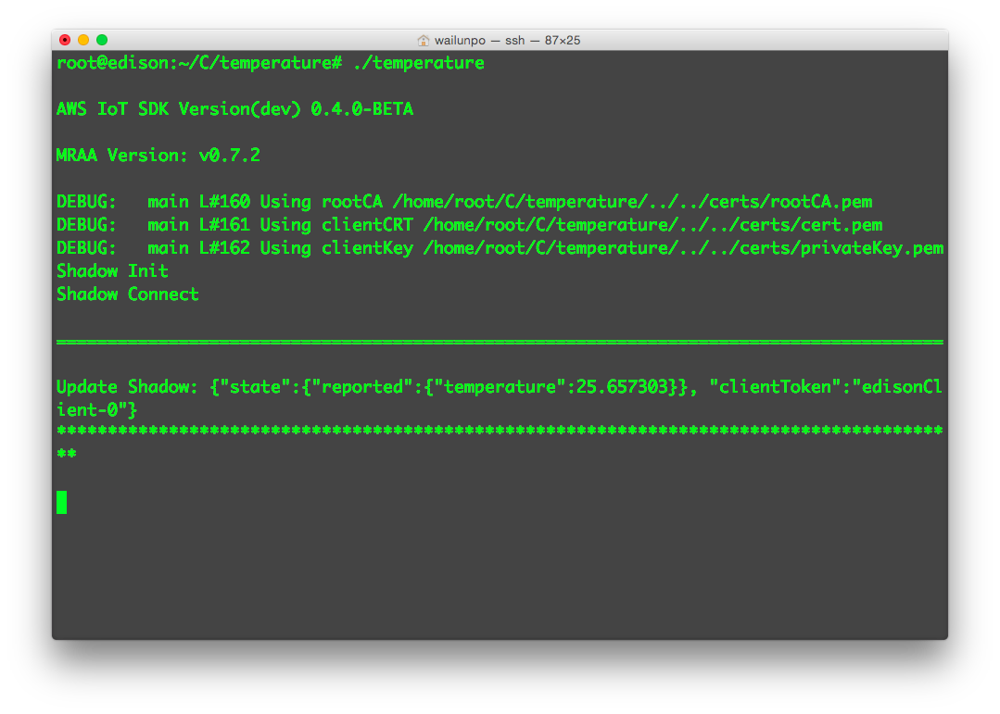

## Getting Started With Amazon Web Services IoT on Intel Edison with the C SDK

**Before You Begin:**

Instructions below assumes you have your Intel Edison flashed with the latest image and setup with Amazon Web Services IoT. You can find instructions here https://software.intel.com/en-us/iot/library/edison-getting-started and here https://github.com/intel-iot-devkit/aws-iot-intel

**Generate the necessary certificates:**

You can follow the instructions found here: https://github.com/intel-iot-devkit/aws-iot-intel on how to generate certificates and activate them.

You will need:
* privateKey.pem
* cert.pem
* rootCA.pem

**Download and extract the C SDK**
``` bash
$ tar -xf aws-iot-thing-sdk-c.tar
``` 

**Copy over the certificates**
``` bash
$ cp LOCATION_OF_PRIVATE_KEY/privateKey.pem certs/
$ cp LOCATION_OF_CERTIFICATE/cert.pem certs/
$ cp LOCATION_OF_ROOTCA/rootCA.pem certs/
``` 

**Configure your settings**
``` bash
$ cd temperature
$ vi aws_iot_config.h
```

```c
#define AWS_IOT_MQTT_HOST              "MY_INSTANCE.iot.MY_REGION.amazonaws.com" ///<Customer Specific Host
#define AWS_IOT_MQTT_PORT              8883 ///< default port for MQTT/S
#define AWS_IOT_MQTT_CLIENT_ID         "edisonClient" ///< MQTT client ID should be unique
#define AWS_IOT_MY_THING_NAME          "EdisonGroveTemperature" ///< Thing Name of the Shadow Thing
#define AWS_IOT_ROOT_CA_FILENAME       "rootCA.pem" ///< Root CA file name                          
#define AWS_IOT_CERTIFICATE_FILENAME   "cert.pem" ///< Device signed certificate file name          
#define AWS_IOT_PRIVATE_KEY_FILENAME   "privateKey.pem" ///< Device private key filename  
```

**Connecting the temperature sensor**

Connect the Grove temperature sensor to the A0 port on shield attached to the Intel Edison.


**Build & Run**
``` bash
$ make
$ ./temperature
```




 